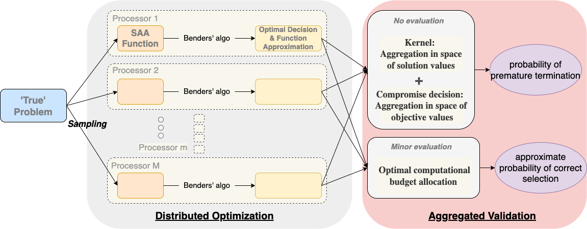
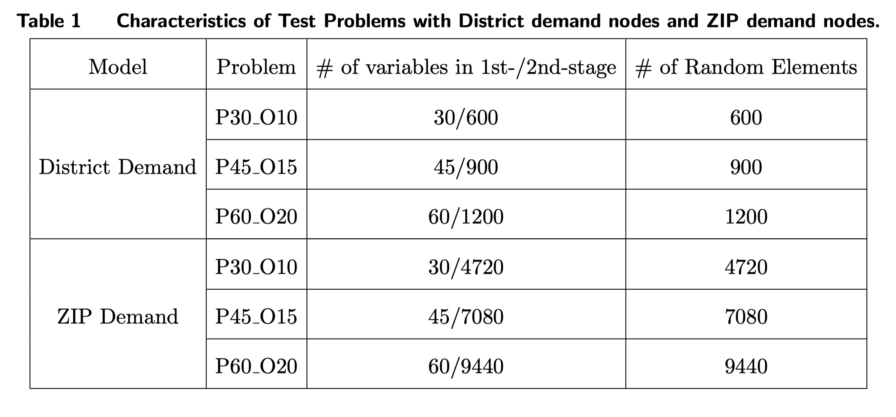
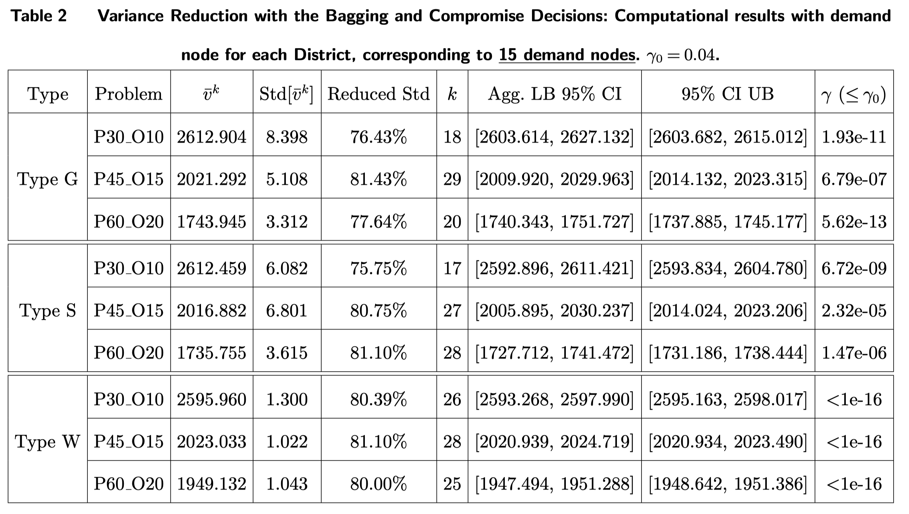
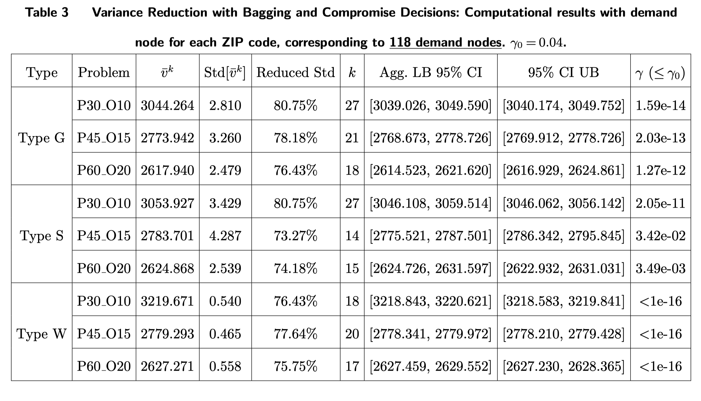
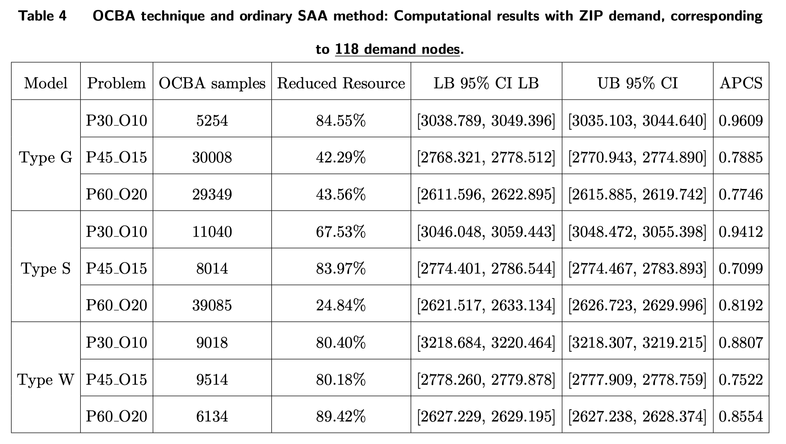
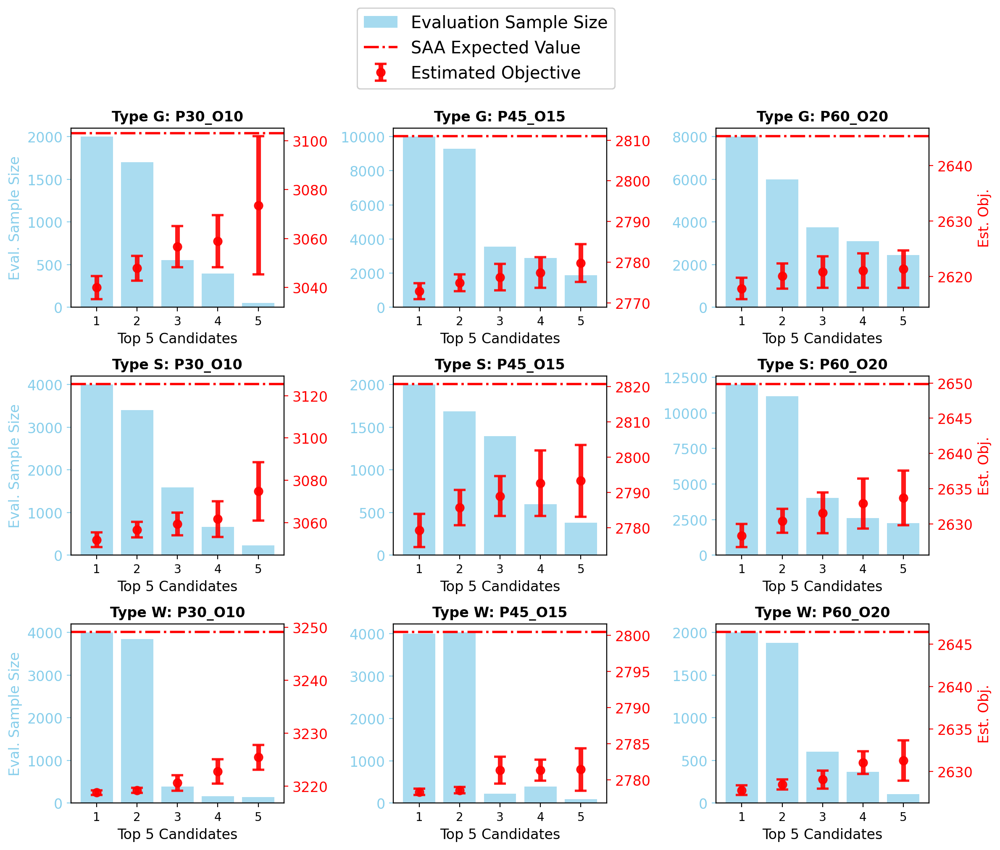

# Ensemble Variance Reduction Methods for Stochastic Mixed-Integer Programming and their Application to the Stochastic Facility Location Problem

This archive is distributed in association with the University of Southern California under the MIT License.

The software and data in this repository are a snapshot of the software and data that were used in the research reported on in the paper "Ensemble Variance Reduction Methods for Stochastic Mixed-Integer Programming and their Application to the Stochastic Facility Location Problem" by Jiajun Xu and Suvrajeet Sen.

A high-level structure of our algorithm is:


## Cite 
To cite the contents of this repository, please cite both the paper and this repo, using their respective DOIs.

https://doi.org/10.1287/ijoc.2021.0324

https://doi.org/10.1287/ijoc.2021.0324.cd

Below is the BibTex for citing this snapshot of the repository.
```
@article{EVR,
  author =        {J. Xu, S. Sen},
  publisher =     {INFORMS Journal on Computing},
  title =         {Ensemble Variance Reduction Methods for Stochastic Mixed-Integer Programming and their Application to the Stochastic Facility Location Problem},
  year =          {2023},
  doi =           {10.1287/ijoc.2021.0324.cd},
  url =          {https://github.com/INFORMSJoC/2021.0324},
}
```

## Description
The goal of this software is to demonstrate the effect of ensemble variance reduction methods in the paper, including the kernel+compromise decision and the efficient budget allocation methods.

## Building
A prerequisite to build the files is a license for IBM CPLEX. Our source code can be quickly built with Apple Xcode. Please use the project files 'LShape_xcode.xcodeproj' in src/SMIP_VarianceReduction or in src/SMIP_OCBA. Alternatively, our code can be built with CMAKE. All the source files are in the src folder.

## Results





The following figure illustrates the OCBA computational results: the evaluated sample size and estimated objective for the top 5 candidate solutions.


## Replicating
To replicate the results, please compile the src for both variance reduction and the efficient budget allocation methods. Please use the scripts in the 'scripts' folder, and run the compiled programs with the input data in the 'data' folder.

For example, if you want to run the first variance reduction method in the paper. Here are the steps:
1. Copy all the instances in the 'data' folder to 'src/SMIP_VarianceReduction/LShape_xcode/spInput'
2. cd src/SMIP_VarianceReduction/LShape_xcode
2. Unzip the 'compiled file.zip'
3. Execute 'run.sh'

## Support
For support in using this software, submit an issue.
